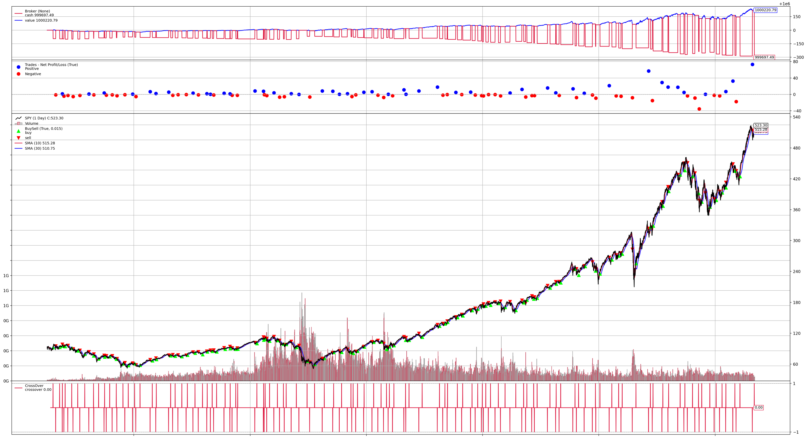

# silver

## Quick Start
```shell
make backtrader_csv symbol=SPY strategy=sma plot=true
```
Outout:
```shell
2024-05-27 13:20:45.597 | INFO     | src.csv.csv:handle_csv:8 - handle_csv SPY
[*********************100%%**********************]  1 of 1 completed
2024-05-27 13:20:48.316 | INFO     | src.brokers.ibkr.backtrade:handler_backtrader:10 - handle_backtrader <class 'strategies.smacross.SmaCross'>, is_plotting: True
2024-05-27 13:20:48.316 | INFO     | src.brokers.ibkr.backtrade:handler_backtrader:20 - Starting Portfolio Value: 1000000.00
2024-05-27 13:20:50.318 | INFO     | src.brokers.ibkr.backtrade:handler_backtrader:41 - Final Portfolio Value: 1000220.79
2024-05-27 13:20:50.318 | INFO     | src.brokers.ibkr.backtrade:handler_backtrader:48 - ******** Statistics ********
2024-05-27 13:20:50.318 | INFO     | src.brokers.ibkr.backtrade:handler_backtrader:49 - Sharpe Ratio:-397.1889577815846
2024-05-27 13:20:50.318 | INFO     | src.brokers.ibkr.backtrade:handler_backtrader:50 - Returns:0.00022076562947569953
2024-05-27 13:20:50.318 | INFO     | src.brokers.ibkr.backtrade:handler_backtrader:51 - DrawDown:0.007492560379431464
2024-05-27 13:20:50.318 | INFO     | src.brokers.ibkr.backtrade:handler_backtrader:52 - ****************************
```


## Commands
### Backtest
#### Download CSV file
Download maximum timerange of Yahoo Finance
```shell
make csv symbol=<stock symbol>
```
#### Backtest with backtrader
1. Download data
2. Backtest with given strategy
```shell
make backtrader_csv symbol=<stock symbol> strategy=<strategy abbreviation in main.py> plot=<true or false>
```

### Live trading
#### Live trade with IBKR TWS 
```shell
make live symbol=<stock symbol> strategy=<strategy abbreviation in main.py>
```

## References
https://www.backtrader.com/
https://github.com/ultra1971/backtrader_ib_insync